 with "Clear" button

- Keyboard appears with search button

1. **Search Execution**

- User types query
- Must press "Search" button to execute (not instant search)
- Shows loading indicator while searching

2. **Search Results**

- Market cards (same format as feed)
- Sorted by relevance
- Tap result → Navigate to market details

3. **Recent Searches**

- Stored locally (max 10)
- Clearable via "Clear" button
- Tapping recent search executes it immediately

4. **Exit Search**

- "Cancel" button returns to Explore feed
- Back button also exits search

**Empty State:**

- "No markets found for '[query]'"
- "Try different keywords"

---

### 2.3 Market Details Page

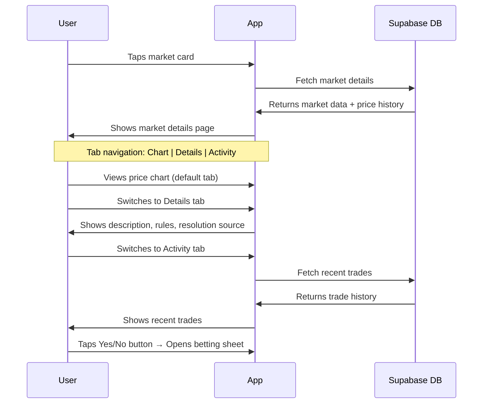

**Page Structure:**

1. **Header**

- Back button (left)
- Share button (right)

2. **Market Image** (large, full-width)
2. **Category Tag** (overlay on image)
3. **Market Question** (full text, no truncation)
4. **Tab Navigation:** Chart | Details | Activity
5. **Chart Tab** (default)

- Interactive price history graph
- **Time Range Selector:** 1D | 7D | 30D | All
  - 1D: Last 24 hours (hourly data points)
  - 7D: Last 7 days (default, hourly data points)
  - 30D: Last 30 days (daily data points)
  - All: Since market creation (daily data points)
- **For Binary Markets:**
  - Shows price for "Yes" outcome (single line)
  - "No" price is implied (1 - Yes price)
- **For Multi-Outcome Markets:**
  - Shows all outcomes on one chart (multiple colored lines)
  - Legend below chart showing outcome labels and colors
  - Each line represents one outcome's price over time
- **Chart Interaction:**
  - Tap/drag on chart to see price at specific time
  - Tooltip shows: timestamp, price(s), volume at that point
  - Pinch to zoom (mobile)
- **Data Points:**
  - Price snapshots stored hourly
  - Chart interpolates between snapshots for smooth line
- X-axis: Time (hours for 1D/7D, days for 30D/All)
- Y-axis: Price (GHS 0.00 - 1.00)
- Current price displayed prominently above chart
- Volume bar chart below price chart (optional, can be toggled)

7. **Details Tab**

- Market description (full text)
- Resolution rules (how winner is determined)
- Resolution source (API, oracle, or manual)
- Market close time
- Volume (total shares traded)
- Created date

8. **Activity Tab**

- Recent trades on this market
- Each trade shows:
  - Outcome traded (Yes/No or outcome label)
  - Shares bought/sold
  - Price
  - Time ago
- "Anonymous User" (no user identification for privacy)

9. **User's Position** (if exists)

- Card showing user's current position on this market
- Outcome, shares held, current value, P/L
- "Cash Out" button

10. **Sticky Bottom Bar**

- Current prices for all outcomes
  - Yes/No buttons (or Buy buttons for each outcome)
  - Same betting flow as feed

**Closed Markets:**

- Hidden from Explore feed
- Still accessible via direct link or Portfolio
- Bet buttons disabled/hidden
- "Closed" badge shown
- Chart and details still viewable

---

## 2.3.1 Trending Markets Logic

Markets are marked as "trending" based on an activity score calculated from multiple factors:

**Activity Score Formula:**

```
activity_score = (0.5 × normalized_volume) + 
                 (0.3 × normalized_traders) + 
                 (0.2 × price_volatility)
```

Where:

- **normalized_volume**: Trading volume in last 24 hours / max volume across all markets
- **normalized_traders**: Unique traders in last 24 hours / max traders across all markets  
- **price_volatility**: Standard deviation of price changes in last 24 hours

**Trending Threshold:**

- Top 10 markets by activity score are marked as trending
- Minimum threshold: activity_score > 0.3 (to avoid marking low-activity markets)

**Update Frequency:**

- Recalculated every 5 minutes
- Cached for performance

**Display:**

- Fire icon (🔥) overlay on market card image (top-right corner)
- "Trending" badge in market details

---

## 2.4 Market Mechanics (LMSR & Parimutuel)

This section defines how market pricing works using LMSR (Logarithmic Market Scoring Rule) and the alternative parimutuel mode.

### 2.4.1 LMSR (Logarithmic Market Scoring Rule)

LMSR is an automated market maker that provides dynamic pricing and guaranteed liquidity. It adjusts prices based on trading activity to reflect market sentiment.

**Key Parameters:**

- **b (liquidity parameter)**: Controls market depth and price sensitivity
  - Higher b = more liquidity, slower price movement
  - Lower b = less liquidity, faster price movement
  - Default: b = 100 (configurable per market by admin)
- **q (quantity vector)**: Number of shares outstanding for each outcome
  - q = [q₁, q₂, ..., qₙ] for n outcomes
  - Initial seed: Admin-defined per market (can be 0 or small positive values)

**Cost Function:**

The cost function determines the total cost to reach a given quantity state:

```
C(q) = b × ln(Σᵢ exp(qᵢ / b))
```

Where:

- C(q) = Total cost to reach quantity state q
- b = Liquidity parameter
- qᵢ = Quantity of shares for outcome i
- Σᵢ = Sum over all outcomes

**Price Function:**

The instantaneous price (probability) for outcome i:

```
pᵢ = exp(qᵢ / b) / Σⱼ exp(qⱼ / b)
```

Where:

- pᵢ = Current price for outcome i (between 0 and 1)
- Prices sum to 1 across all outcomes: Σᵢ pᵢ = 1

**Buying Shares:**

When a user wants to buy shares with a given stake amount:

1. User provides: stake amount (S) and desired outcome (i)
2. System must find Δqᵢ such that: `C(q + Δq) - C(q) = S`
3. This requires solving: `b × ln(Σⱼ exp((qⱼ + Δqⱼ) / b)) - b × ln(Σⱼ exp(qⱼ / b)) = S`
4. Where Δqⱼ = Δqᵢ if j = i, else 0

**Binary Search Algorithm:**

Since the equation above has no closed-form solution, use binary search:

```
function findSharesForStake(stake, outcomeIndex, currentQ, b):
    low = 0
    high = stake * 10  // Upper bound estimate
    epsilon = 0.0001   // Convergence threshold
    
    while (high - low) > epsilon:
        mid = (low + high) / 2
        
        // Calculate cost for buying 'mid' shares
        newQ = currentQ.copy()
        newQ[outcomeIndex] += mid
        
        cost = b * ln(sum(exp(newQ[j] / b) for j in outcomes)) - 
               b * ln(sum(exp(currentQ[j] / b) for j in outcomes))
        
        if cost < stake:
            low = mid
        else:
            high = mid
    
    return (low + high) / 2
```

**Selling Shares (Cash-Out):**

When a user cashes out (sells shares back to the AMM):

1. User has qᵢ shares of outcome i
2. Cash-out value = `C(q) - C(q - Δq)` where Δqᵢ = user's shares
3. This is calculated as:

  ```
   value = b × ln(Σⱼ exp(qⱼ / b)) - b × ln(Σⱼ exp((qⱼ - Δqⱼ) / b))
  ```

4. Market state updates: q → q - Δq
2. Prices recalculate based on new q

**Worked Example (Binary Market):**

Initial state:

- b = 100
- q = [0, 0] (no shares outstanding)
- Prices: p_yes = 0.5, p_no = 0.5

User 1 buys "Yes" with 65 GHS stake:

1. Binary search finds Δq_yes ≈ 100 shares
2. New state: q = [100, 0]
3. New prices:

- p_yes = exp(100/100) / (exp(100/100) + exp(0/100)) = e¹ / (e¹ + e⁰) ≈ 0.731
- p_no = exp(0/100) / (exp(100/100) + exp(0/100)) = e⁰ / (e¹ + e⁰) ≈ 0.269

4. User receives 100 shares of "Yes"
2. Potential payout if "Yes" wins: 100 shares × 1 GHS = 100 GHS

User 2 buys "No" with 50 GHS stake:

1. Binary search finds Δq_no ≈ 185 shares
2. New state: q = [100, 185]
3. New prices:

- p_yes ≈ 0.30
- p_no ≈ 0.70

4. User 2 receives 185 shares of "No"

User 1 cashes out:

1. User 1 has 100 shares of "Yes"
2. Cash-out value = C([100, 185]) - C([0, 185]) ≈ 30 GHS
3. User 1 receives 30 GHS (loss of 35 GHS from original 65 GHS stake)
4. New state: q = [0, 185]
5. New prices: p_yes ≈ 0.15, p_no ≈ 0.85

### 2.4.2 Parimutuel Mode (Alternative)

For markets where admin selects parimutuel pricing (market-level toggle):

**How It Works:**

- All stakes go into a pool
- Odds are determined by the ratio of stakes on each outcome
- No automated market maker; users bet against each other
- Simpler calculation, faster for demos

**Price Calculation:**

```
pᵢ = Total stake on outcome i / Total stake on all outcomes
```

**Payout Calculation:**

```
Payout for winner = (Total pool / Total stake on winning outcome) × User's stake
```

**Example:**

- Total pool: 1000 GHS
- Stake on "Yes": 600 GHS
- Stake on "No": 400 GHS
- User bets 100 GHS on "Yes"
- If "Yes" wins: Payout = (1000 / 600) × 100 = 166.67 GHS

**When to Use:**

- Admin can select parimutuel mode when creating market
- Useful for simple events or when LMSR complexity isn't needed
- Faster settlement (no complex state management)

**Limitations:**

- No guaranteed liquidity (need counterparties)
- Prices can be volatile with small pools
- No cash-out mechanism (must wait for settlement)

---

## 3. Betting Flows

### 3.1 Quick Bet from Feed (Binary Market)

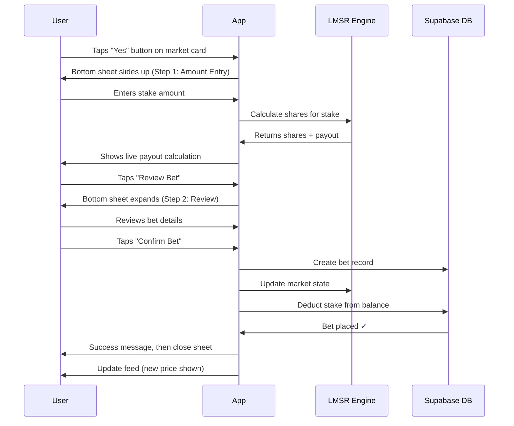

**Step 1: Amount Entry (Bottom Sheet)**

**Sheet Header:**

- Market question (truncated to 1 line)
- Selected outcome badge: "Yes" or "No" (color-coded)
- Close button (X)

**Content:**

- Current price display: "GHS 0.65 per share"
- Amount input field (large, focused)
  - Placeholder: "Enter amount"
  - Numeric keyboard
  - Balance shown subtly below: "Balance: GHS 1,234.56"
- **Live payout calculation** (updates as user types):
  - "You'll receive: ~X shares"
  - "Potential payout: GHS Y.YY"
- Quick amount buttons (fixed amounts):
  - [10] [50] [100] [500] [Max]
  - Max button fills entire balance
- "Review Bet" button (disabled until valid amount entered)

**Validation:**

- Soft limit: User can enter any amount
- If amount > balance: Error shown on review step (not here)

**Step 2: Review (Bottom Sheet Expands)**

**Content:**

- Market question (full text)
- Selected outcome (Yes/No badge, prominent)
- Bet summary:
  - **Stake:** GHS X.XX
  - **Shares:** Y.YY shares @ GHS Z.ZZ avg price
  - **Potential payout:** GHS P.PP (if outcome wins)
- Balance change:
  - Current: GHS 1,234.56
  - After bet: GHS 1,134.56
- Market close time: "Closes in 2 days 5 hours"
- "Confirm Bet" button (large, prominent)
- "Edit" button (returns to Step 1)

**Confirmation:**

- User taps "Confirm Bet"
- Bet placed immediately (no additional confirmation)
- Success message: "Bet placed successfully!"
- Sheet closes after 1 second
- Feed updates to show new market price

**Error Handling:**

- Insufficient balance (detected on review):
  - Error message: "Insufficient balance"
  - In Paper Mode: "Refill Paper Balance" button (if balance < 5 GHS)
  - In Live Mode: "Deposit Now" button → Opens deposit flow
- Market closed:
  - Error: "This market is closed"
  - Sheet closes automatically
- Network error:
  - Error: "Failed to place bet. Please try again."
  - "Retry" button

---

### 3.2 Bet from Market Details (Multi-Outcome)

**Same flow as quick bet, with differences:**

1. **Outcome Selection**

- User taps "Buy" button next to specific outcome
- Bottom sheet shows selected outcome label (not just Yes/No)

2. **Multiple Outcomes**

- Each outcome has its own "Buy" button
- Betting flow identical for each outcome

3. **User's Existing Position**

- If user already has position on this market (different outcome):
  - Show warning: "You already have a position on [Other Outcome]"
  - Allow bet anyway (users can bet on multiple outcomes)

---

### 3.3 Insufficient Balance Handling

**In Paper Mode:**

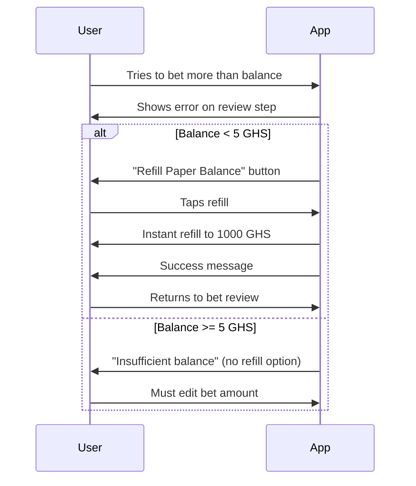

**In Live Mode:**

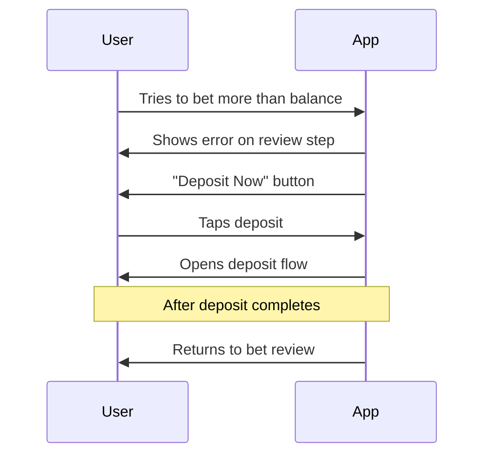

---

## 4. Portfolio Management Flows

### 4.1 Portfolio View Structure

**Two Tabs:**

1. **Open** - Active positions (unsettled bets)
2. **Settled** - Completed bets (won/lost)

**Filters (Settled tab only):**

- All | Won | Lost
- Horizontal chip filters

**Sorting:**

- Open positions: Sorted by market close time (soonest first)
- Settled bets: Sorted by settlement date (most recent first)

**Scroll:**

- Infinite scroll for both tabs

---

### 4.2 Open Positions Display

**Position Card Structure:**

```
┌─────────────────────────────────────┐
│  Market Question (truncated)        │
│  [Yes Badge] or [No Badge]          │
├─────────────────────────────────────┤
│  100 shares @ GHS 0.65              │
│  Current price: GHS 0.72            │
│  Current value: GHS 72.00           │
│  P/L: +GHS 7.00 (green)             │
├─────────────────────────────────────┤
│  [Cash Out Button]                  │
└─────────────────────────────────────┘
```

**Information Shown:**

- Market question (truncated to 2 lines)
- Outcome user bet on (Yes/No badge or outcome label)
- Shares held + average price paid
- Current market price (live, updating)
- Current value (shares × current price)
- Unrealized P/L (amount in GHS, color-coded green/red)

**Interactions:**

- Tap card (not on button) → Navigate to market details
- Tap "Cash Out" → Open cash-out bottom sheet

**Empty State:**

- Illustration + message + action
- "No open positions"
- "Explore markets to place your first bet"
- "Browse Markets" button → Navigate to Explore

---

### 4.3 Cash-Out Flow

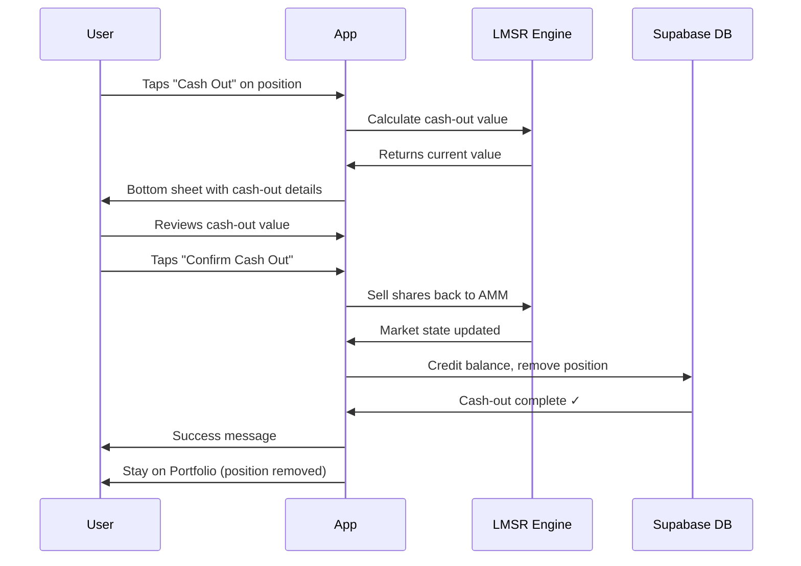

**Cash-Out Bottom Sheet:**

**Content:**

- Market question (full text)
- Current position:
  - Outcome (Yes/No badge)
  - Shares held: 100 shares @ GHS 0.65 avg
- Current market price: GHS 0.72
- Cash-out value: GHS 72.00
- P/L summary:
  - Original stake: GHS 65.00
  - Cash-out value: GHS 72.00
  - Profit: +GHS 7.00 (green) or Loss: -GHS 5.00 (red)
- "Confirm Cash Out" button (large, prominent)
- "Cancel" button

**Confirmation:**

- User taps "Confirm Cash Out"
- Shares sold back to AMM immediately
- Balance updated
- Position removed from Open tab
- Success message: "Cashed out successfully!"
- Sheet closes
- User stays on Portfolio tab

**Notes:**

- Full cash-out only (no partial cash-out)
- No warning about price impact
- Selling shares affects market prices (LMSR recalculates)

---

### 4.4 Settled Bets Display

**Bet Card Structure (Won):**

```
┌─────────────────────────────────────┐
│  Market Question (truncated)        │
│  [Yes Badge] [Won Badge - green]    │
├─────────────────────────────────────┤
│  Stake: GHS 65.00                   │
│  Payout: GHS 100.00                 │
│  Profit: +GHS 35.00 (green)         │
│  Settled: 2 days ago                │
└─────────────────────────────────────┘
```

**Bet Card Structure (Lost):**

```
┌─────────────────────────────────────┐
│  Market Question (truncated)        │
│  [No Badge] [Lost Badge - red]      │
├─────────────────────────────────────┤
│  Stake: GHS 50.00                   │
│  Payout: GHS 0.00                   │
│  Loss: -GHS 50.00 (red)             │
│  Settled: 5 days ago                │
└─────────────────────────────────────┘
```

**Information Shown:**

- Market question (truncated)
- Outcome user bet on
- Final result badge (Won/Lost, color-coded)
- Stake amount
- Payout amount (if won) or GHS 0.00 (if lost)
- P/L (profit or loss)
- Settlement date (relative time)

**Visual Distinction:**

- Won bets: Green accent (left border or background tint)
- Lost bets: Red accent

**Filters:**

- All: Shows all settled bets
- Won: Shows only winning bets
- Lost: Shows only losing bets

**Interactions:**

- Tap card → Navigate to market details (historical view)

**Empty State:**

- "No settled bets yet"
- "Your completed bets will appear here"

---

## 5. Wallet & Payment Flows

### 5.1 Profile Section Structure

**Single Scrolling List:**

```
┌─────────────────────────────────────┐
│  User Info Card                     │
│  Name, Phone, Edit button           │
├─────────────────────────────────────┤
│  Wallet Card                        │
│  Balance, Mode toggle, Deposit/     │
│  Withdraw buttons                   │
├─────────────────────────────────────┤
│  Settings List                      │
│  - Odds Format                      │
│  - Notifications                    │
│  - Transaction History              │
│  - Help & Support                   │
│  - Terms & Conditions               │
│  - Privacy Policy                   │
├─────────────────────────────────────┤
│  Logout Button                      │
└─────────────────────────────────────┘
```

---

### 5.2 Wallet Card (in Profile)

**Paper Mode:**

```
┌─────────────────────────────────────┐
│  Paper Mode [Toggle]                │
│  Available Balance                  │
│  GHS 1,234.56                       │
│  [Refill] (if balance < 5 GHS)      │
└─────────────────────────────────────┘
```

**Live Mode:**

```
┌─────────────────────────────────────┐
│  Live Mode [Toggle]                 │
│  Available Balance                  │
│  GHS 1,234.56                       │
│  [Deposit]  [Withdraw]              │
└─────────────────────────────────────┘
```

---

### 5.3 Mode Switching Flow

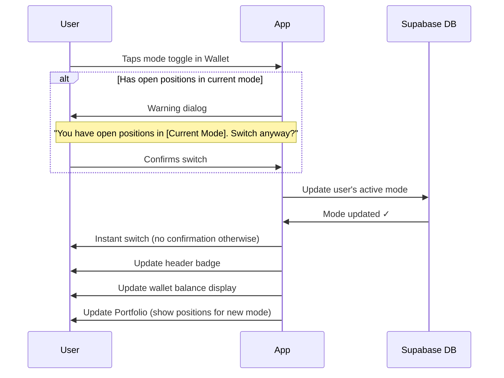

**Behavior:**

- No confirmation dialog (instant switch)
- **Exception:** If user has open positions in current mode:
  - Show warning: "You have X open positions in [Current Mode]. Switching modes won't affect them. Continue?"
  - User can confirm or cancel
- Mode persists for next session (remembered)
- All screens update immediately:
  - Header badge
  - Wallet balance
  - Portfolio positions (filtered by mode)

**Switching to Live Mode with 0 Balance:**

- No forced deposit prompt
- User can browse markets and see prices
- Deposit prompt appears when trying to bet with insufficient balance

---

### 5.4 Paper Balance Refill Flow

**Trigger:**

- Automatic prompt when balance drops below 5 GHS
- Persistent banner at top of screen (in Paper Mode only)

**Banner:**

```
┌─────────────────────────────────────┐
│  📄 Low balance! Refill to 1000 GHS │
│  [Refill Now]                       │
└─────────────────────────────────────┘
```

**Flow:**

1. User taps "Refill Now"
2. Instant refill to 1000 GHS (no confirmation)
3. Success toast: "Paper balance refilled to 1000 GHS"
4. Banner disappears

**Eligibility:**

- Only available when balance < 5 GHS
- One-time grant on first access (1000 GHS)
- Unlimited refills when balance drops below threshold

---

### 5.5 Deposit Flow (Mock)

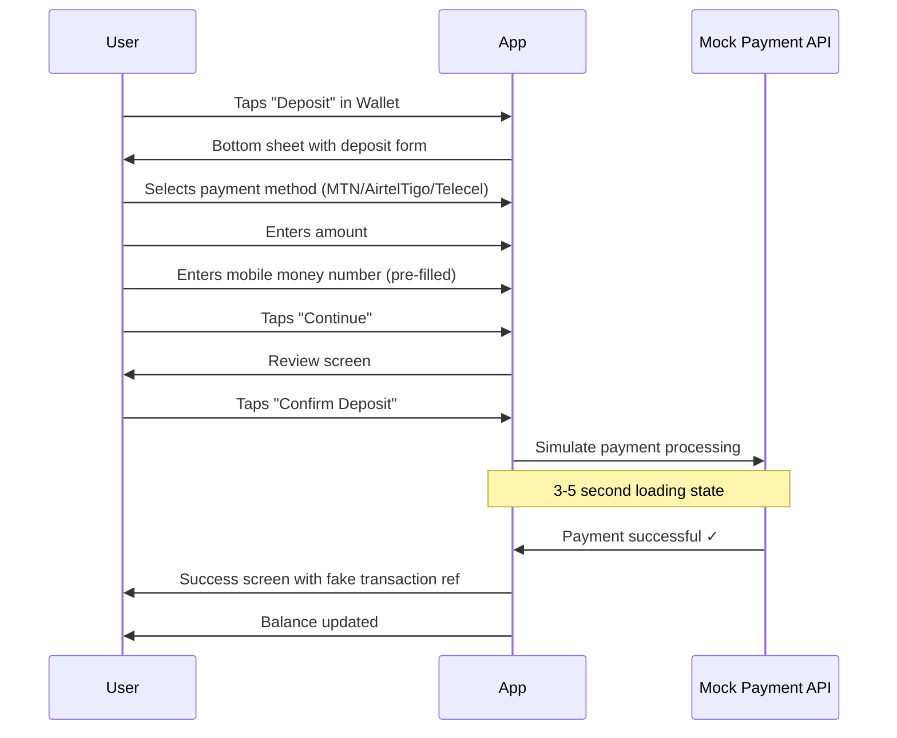

**Step 1: Payment Method Selection**

- Radio buttons:
  - ⚪ MTN Mobile Money
  - ⚪ AirtelTigo Money
  - ⚪ Telecel Cash
- "Continue" button

**Step 2: Amount Entry**

- Amount input (numeric keyboard)
- Min/max limits shown: "Min: GHS 10, Max: GHS 10,000"
- Mobile money number input (pre-filled with user's phone)
- "Continue" button

**Step 3: Review**

- Payment method: MTN Mobile Money
- Amount: GHS 100.00
- Fees: GHS 0.00 (or show fee if applicable)
- Total: GHS 100.00
- Mobile number: 233XXXXXXXXX
- "Confirm Deposit" button

**Step 4: Processing**

- Loading spinner
- "Processing payment..." message
- Simulated 3-5 second delay

**Step 5: Success**

- Success icon ✓
- "Deposit successful!"
- Transaction reference: "TXN-MOCK-123456"
- New balance: GHS 1,334.56
- "Done" button → Close sheet

**Transaction History:**

- Accessible from Profile → Transaction History
- Shows all deposits, withdrawals, bets, payouts

---

### 5.6 Withdrawal Flow (Mock)

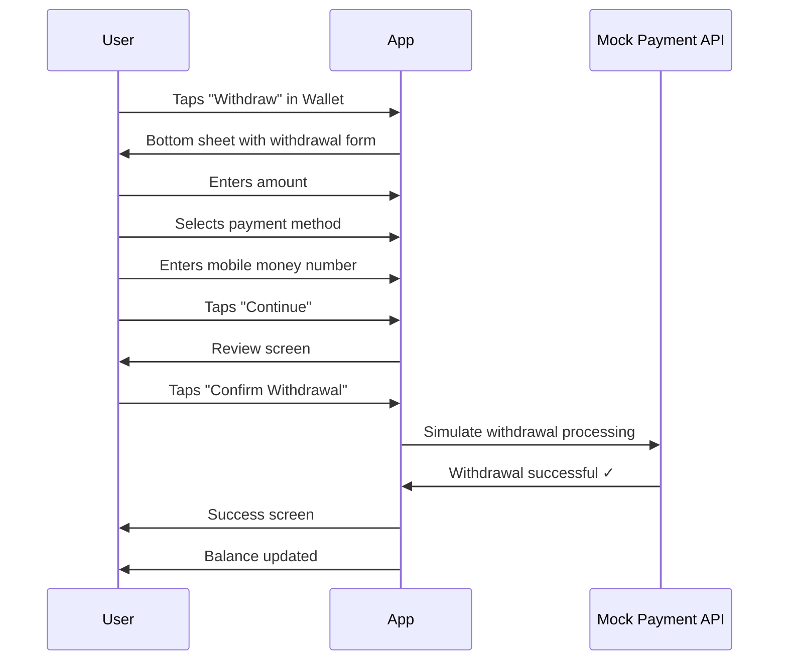

**Step 1: Amount Entry**

- Available balance shown: "Available: GHS 1,234.56"
- Amount input
- Min withdrawal enforced: "Min: GHS 10"
- Daily limit shown: "Daily limit: GHS 5,000"
- "Continue" button

**Step 2: Payment Method & Number**

- Select payment method (MTN/AirtelTigo/Telecel)
- Mobile money number input (pre-filled)
- "Continue" button

**Step 3: Review**

- Amount: GHS 500.00
- Fees: GHS 0.00 (or show fee)
- You'll receive: GHS 500.00
- Mobile number: 233XXXXXXXXX
- "Confirm Withdrawal" button

**Step 4: Processing**

- Loading spinner
- "Processing withdrawal..." message
- Simulated 3-5 second delay

**Step 5: Success**

- Success icon ✓
- "Withdrawal successful!"
- "Funds will arrive in 5-10 minutes"
- Transaction reference: "WTH-MOCK-789012"
- New balance: GHS 734.56
- "Done" button

**Constraints:**

- Minimum withdrawal: GHS 10 (enforced)
- Daily withdrawal limit: GHS 5,000 (enforced)
- Allowed even with open positions (no restriction)

---

## 6. Special Flows & System States

### 6.1 Settlement Notification

**When Market Settles:**

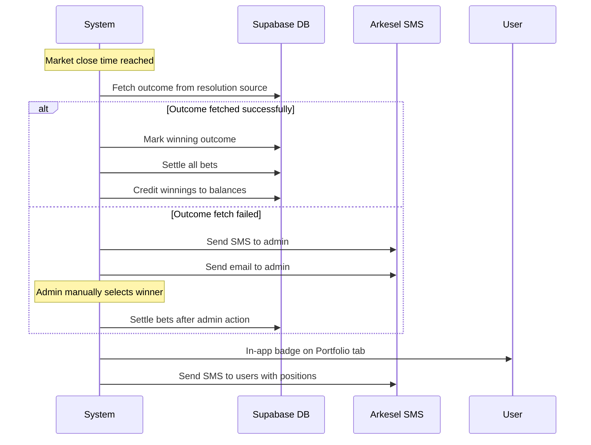

**User Notification:**

1. **In-app badge** on Portfolio tab (red dot)
2. **SMS notification** (via Arkesel):

- "Your bet on '[Market]' has settled. You won GHS X.XX!" (if won)
- "Your bet on '[Market]' has settled." (if lost)

**Portfolio Badge:**

- Red dot on Portfolio tab icon
- Clears when user views Settled tab

---

### 6.1.1 Market Resolution (Automatic & Manual)

This section details how markets are resolved (winning outcome determined) at close time.

**Resolution Flow:**

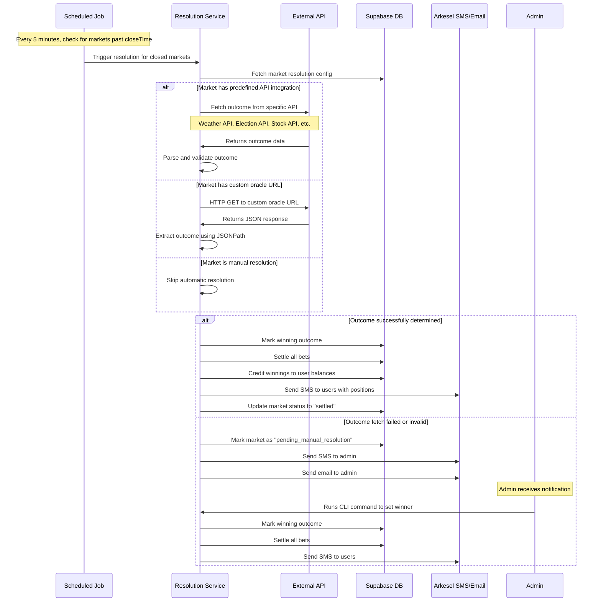

**Resolution Source Types:**

**1. Predefined API Integrations:**

For common event types, the system has built-in integrations:

**Weather Events:**

- API: OpenWeatherMap
- Example: "Will it rain in Accra on Dec 25?"
- Config: `{ type: "weather", location: "Accra", date: "2024-12-25", condition: "rain" }`
- Resolution: Fetch weather data for date, check if precipitation > 0mm

**Election Results:**

- API: Ghana Electoral Commission API or news APIs
- Example: "Who will win the 2024 presidential election?"
- Config: `{ type: "election", year: 2024, position: "president" }`
- Resolution: Fetch official results, return winning candidate

**Stock Prices:**

- API: Alpha Vantage or Yahoo Finance
- Example: "Will TSLA stock hit $200 by EOY?"
- Config: `{ type: "stock", symbol: "TSLA", threshold: 200, date: "2024-12-31" }`
- Resolution: Fetch closing price on date, compare to threshold

**Crypto Prices:**

- API: CoinGecko
- Example: "Will BTC exceed $50k by March?"
- Config: `{ type: "crypto", symbol: "bitcoin", threshold: 50000, date: "2024-03-31" }`
- Resolution: Fetch price on date, compare to threshold

**Sports Events:**

- API: Sports data providers
- Example: "Will Lakers make playoffs?"
- Config: `{ type: "sports", league: "NBA", team: "Lakers", season: "2024" }`
- Resolution: Fetch playoff standings, check if team qualified

**2. Custom Oracle (Generic HTTP Endpoint):**

For events without predefined integration, admin provides:

- **Oracle URL**: HTTP endpoint that returns outcome data
- **JSONPath**: Path to extract winning outcome from response
- **Outcome Mapping**: Maps API response values to market outcomes

**Example:**

```json
{
  "resolution_type": "custom_oracle",
  "oracle_url": "https://api.example.com/nsmq/2025/winner",
  "json_path": "$.data.winner.school_name",
  "outcome_mapping": {
    "Prempeh College": "outcome_id_1",
    "Presec Legon": "outcome_id_2",
    "Opoku Ware": "outcome_id_3"
  }
}
```

**Resolution Process:**

1. System makes GET request to oracle_url
2. Parses JSON response
3. Extracts value using json_path
4. Maps value to outcome_id using outcome_mapping
5. Marks that outcome as winner

**3. Manual Resolution:**

For events that can't be automatically resolved:

- Admin sets `resolution_type: "manual"`
- System skips automatic resolution
- Admin must manually select winner via CLI

**Admin Notification (When Auto-Resolution Fails):**

**SMS Format:**

```
Market Resolution Required

Market: "[Market Title]"
ID: [market_id]
Closed: [close_time]

Automatic resolution failed. Please resolve manually:

npm run settle-market --id=[market_id]
```

**Email Format:**

```
Subject: Action Required: Market Resolution Failed

Hello Admin,

The following market requires manual resolution:

Title: [Market Title]
ID: [market_id]
Close Time: [close_time]
Outcomes:
  - [Outcome 1]
  - [Outcome 2]
  - ...

Reason: [Error message from API]

To resolve this market, run:

npm run settle-market --id=[market_id] --winner=[outcome_id]

Or use the interactive prompt:

npm run settle-market --id=[market_id]

Thank you,
Prediction Market System
```

**Retry Logic:**

- System retries failed API calls 3 times with exponential backoff (1min, 5min, 15min)
- After 3 failures, sends admin notification
- Admin notification sent only once per market

**Validation:**

- API response must be received within 30 seconds (timeout)
- Extracted outcome must match one of the market's defined outcomes
- If validation fails, treat as resolution failure

---

### 6.2 Closed Market Handling

**When Market Closes:**

- Market automatically closes at `closeTime`
- Bet buttons disabled/hidden
- "Closed" badge shown on market details
- Market hidden from Explore feed
- Still accessible via:
  - Direct link
  - Portfolio (if user has position)
  - Search (if user searches for it)

**After Settlement:**

- Market archived (no longer searchable)
- Still accessible via direct link
- Historical data preserved

---

### 6.3 Error States & Offline Handling

**Offline Detection:**

- Persistent banner at top: "You're offline. Some features may not work."
- Banner disappears when connection restored

**Cached Data:**

- Market feed cached for offline viewing
- Last-fetched prices shown with "Last updated: X minutes ago"
- User can browse cached markets

**Failed Actions:**

- Show error message with "Retry" button
- Examples:
  - "Failed to place bet. Please try again."
  - "Failed to load markets. Please check your connection."
  - "Failed to update balance. Please try again."

**Retry Behavior:**

- Manual retry only (no auto-retry)
- "Retry" button on error screens

---

### 6.4 Empty States

**Consistent Pattern:**

- Illustration (simple icon or graphic)
- Message (clear, friendly)
- Action button (if applicable)

**Examples:**

**No Markets in Feed:**

- Illustration: 📊
- Message: "No markets available yet"
- Submessage: "Check back soon for new markets"
- No action button

**No Open Positions:**

- Illustration: 📈
- Message: "No open positions"
- Submessage: "Explore markets to place your first bet"
- Action: "Browse Markets" → Navigate to Explore

**No Settled Bets:**

- Illustration: 🏆
- Message: "No settled bets yet"
- Submessage: "Your completed bets will appear here"
- No action button

**No Search Results:**

- Illustration: 🔍
- Message: "No markets found for '[query]'"
- Submessage: "Try different keywords"
- No action button

**No Transaction History:**

- Illustration: 💰
- Message: "No transactions yet"
- Submessage: "Your deposits and withdrawals will appear here"
- No action button

---

## 7. Odds Format Display

**User Preference:**

- Setting in Profile → Odds Format
- Options: Decimal | Fractional | American

**Conversion Logic:**

LMSR gives probability-based prices (0-1). To display as traditional odds:

**Decimal Odds:**

- Formula: `1 / price`
- Example: Price 0.65 → Decimal odds 1.54
- Display: "1.54"

**Fractional Odds:**

- Formula: `(1 / price) - 1` expressed as fraction
- Example: Price 0.65 → 0.54 → "54/100" simplified to "27/50"
- Display: "27/50"

**American Odds:**

- If price > 0.5: `-(price / (1 - price)) × 100`
- If price < 0.5: `((1 - price) / price) × 100`
- Example: Price 0.65 → -186
- Display: "-186"

**Display Location:**

- Market cards: Show in user's preferred format
- Market details: Show in user's preferred format
- Betting sheet: Show in user's preferred format
- All prices update when user changes preference

---

## 8. Navigation Patterns

### 8.1 Bottom Navigation

**Three Tabs:**

1. **Explore** (default)
2. **Portfolio**
3. **Profile**

**Tab Switching:**

- Tap tab → Navigate to that section
- Current tab highlighted (purple)
- Tab state preserved (scroll position, filters)

**Deep Linking:**

- Market details: `/market/[id]`
- Portfolio: `/portfolio?tab=open` or `/portfolio?tab=settled`
- Profile: `/profile`

### 8.2 Back Navigation

**Hardware Back Button (Android):**

- From market details → Return to Explore
- From search → Exit search, return to Explore
- From bottom sheet → Close sheet
- From any tab → Exit app (if on default tab)

**UI Back Button:**

- Shown in header on detail pages
- Tapping returns to previous screen

### 8.3 Bottom Sheet Behavior

**Gestures:**

- Swipe down → Close sheet
- Tap outside → Close sheet
- Tap close button (X) → Close sheet

**State Preservation:**

- If user closes sheet mid-bet, data is lost (no draft saving)

---

## 9. Admin Flows

This section documents the CLI commands available to administrators for managing markets and resolving issues.

### 9.1 Market Creation

**Command:**

```bash
npm run create-market
```

**Interactive Prompts:**

```
🎯 Create New Market

1. Market Title:
   > Will it rain in Accra on Christmas Day 2024?

2. Market Description:
   > This market resolves to "Yes" if there is any measurable
   > precipitation (>0mm) in Accra on December 25, 2024.
   > Data source: OpenWeatherMap API.

3. Market Type:
   [1] Binary (Yes/No)
   [2] Multi-outcome
   > 1

4. Outcomes (for binary, auto-generated: Yes, No):
   Outcome 1: Yes
   Outcome 2: No

5. Close Time (ISO 8601):
   > 2024-12-25T23:59:59Z

6. Market Image:
   [1] Upload local file
   [2] Provide URL
   [3] Skip (use default)
   > 1
   
   File path:
   > ./images/rain-accra.jpg
   
   Uploading to Supabase Storage... ✓
   Image URL: https://[supabase-url]/storage/v1/object/public/market-images/[uuid].jpg

7. Tags (comma-separated):
   > weather, accra, ghana

8. Pricing Model:
   [1] LMSR (dynamic pricing)
   [2] Parimutuel (pool-based)
   > 1

9. Liquidity Parameter (b) [default: 100]:
   > 100

10. Seed Liquidity (shares per outcome) [default: 0]:
    > 0

11. Resolution Type:
    [1] Weather API
    [2] Election API
    [3] Stock API
    [4] Crypto API
    [5] Sports API
    [6] Custom Oracle
    [7] Manual
    > 1

12. Resolution Config (Weather API):
    Location: > Accra
    Date: > 2024-12-25
    Condition: > rain
    
    Generated config:
    {
      "type": "weather",
      "location": "Accra",
      "date": "2024-12-25",
      "condition": "rain"
    }

13. Review:
    Title: Will it rain in Accra on Christmas Day 2024?
    Type: Binary
    Close Time: 2024-12-25T23:59:59Z
    Tags: weather, accra, ghana
    Pricing: LMSR (b=100)
    Resolution: Weather API (Accra, rain)
    
    Create this market? [Y/n]
    > Y

Creating market... ✓
Market ID: mkt_abc123xyz
Market URL: https://[app-url]/market/mkt_abc123xyz

✅ Market created successfully!
```

**Alternative: JSON File Input**

```bash
npm run create-market --file=market.json
```

**market.json:**

```json
{
  "title": "Will it rain in Accra on Christmas Day 2024?",
  "description": "This market resolves to 'Yes' if there is any measurable precipitation (>0mm) in Accra on December 25, 2024. Data source: OpenWeatherMap API.",
  "type": "binary",
  "outcomes": ["Yes", "No"],
  "close_time": "2024-12-25T23:59:59Z",
  "image_url": "https://example.com/rain.jpg",
  "tags": ["weather", "accra", "ghana"],
  "pricing_model": "lmsr",
  "liquidity_parameter": 100,
  "seed_liquidity": 0,
  "resolution": {
    "type": "weather",
    "location": "Accra",
    "date": "2024-12-25",
    "condition": "rain"
  }
}
```

**Validation:**

- Title: 10-200 characters
- Description: 50-2000 characters
- Close time: Must be in the future
- Outcomes: 2-10 outcomes
- Tags: 1-10 tags, each 2-30 characters
- Image: Max 5MB, formats: jpg, png, webp
- Liquidity parameter: 10-10000
- Seed liquidity: 0-1000 per outcome

### 9.2 Market Settlement (Manual)

**Command:**

```bash
npm run settle-market --id=mkt_abc123xyz
```

**Interactive Prompt:**

```
🏁 Settle Market

Market: Will it rain in Accra on Christmas Day 2024?
ID: mkt_abc123xyz
Close Time: 2024-12-25T23:59:59Z
Status: Closed (pending resolution)

Outcomes:
  [1] Yes (45% probability, 120 shares)
  [2] No (55% probability, 150 shares)

Total bets: 45
Total volume: 2,450 GHS

Select winning outcome:
> 1

You selected: Yes

This will:
- Mark "Yes" as the winning outcome
- Settle 45 bets
- Credit 1,850 GHS to winning bettors
- Send SMS notifications to all bettors

Confirm settlement? [Y/n]
> Y

Settling market... ✓
Bets settled: 45
Winners notified: 28
Losers notified: 17

✅ Market settled successfully!
```

**Alternative: Direct Command**

```bash
npm run settle-market --id=mkt_abc123xyz --winner=outcome_yes
```

**Validation:**

- Market must be closed (past close_time)
- Market must not already be settled
- Winner must be a valid outcome ID for this market
- Admin must confirm before settlement (unless --force flag used)

### 9.3 Other Admin Commands

**List Markets:**

```bash
npm run list-markets
npm run list-markets --status=open
npm run list-markets --status=closed
npm run list-markets --status=settled
```

**Close Market Early:**

```bash
npm run close-market --id=mkt_abc123xyz
```

**View Market Details:**

```bash
npm run view-market --id=mkt_abc123xyz
```

---

## 10. Data Model

This section provides a high-level overview of the database schema and entity relationships.

### 10.1 Entity-Relationship Diagram

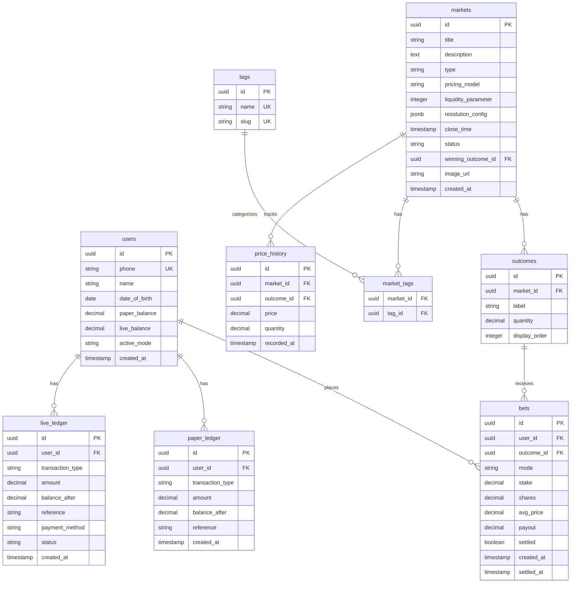

### 10.2 Key Tables

**users**

- Stores user profile and balance information
- `phone`: Unique, used for authentication
- `paper_balance` / `live_balance`: Cached balances for quick lookup
- `active_mode`: Current mode ("paper" or "live")

**markets**

- Core market information
- `type`: "binary" or "multi_outcome"
- `pricing_model`: "lmsr" or "parimutuel"
- `liquidity_parameter`: The 'b' value for LMSR
- `resolution_config`: JSON containing resolution source details
- `status`: "open", "closed", "settled", "cancelled"

**outcomes**

- Possible outcomes for each market
- `quantity`: Current share quantity (q_i in LMSR)
- Binary markets have 2 outcomes, multi-outcome can have 2-10

**bets**

- User positions on markets
- `mode`: "paper" or "live" (which wallet was used)
- `shares`: Number of shares purchased
- `avg_price`: Average price paid per share
- `payout`: Amount credited on settlement (if won)

**paper_ledger / live_ledger**

- Transaction history for each mode
- `transaction_type`: "deposit", "withdrawal", "bet_placed", "bet_won", "bet_lost", "cash_out", "refill"
- `balance_after`: Balance after this transaction
- Provides audit trail and transaction history

**tags / market_tags**

- Flexible tagging system for market categorization
- Many-to-many relationship between markets and tags

**price_history**

- Hourly snapshots of market prices
- Used for price charts
- Stores price and quantity for each outcome

### 10.3 Row-Level Security (RLS)

**users table:**

- Users can SELECT/UPDATE only their own row: `auth.uid() = id`

**bets table:**

- Users can SELECT only their own bets: `auth.uid() = user_id`
- Users can INSERT bets (validated by application logic)

**paper_ledger / live_ledger:**

- Users can SELECT only their own transactions: `auth.uid() = user_id`

**markets, outcomes, tags, price_history:**

- Public read access (all users can SELECT)
- Only service role can INSERT/UPDATE/DELETE

---

## 11. System Configuration

This section documents all configurable parameters and limits in the system.

### 11.1 Betting Limits

**Minimum Bet Amount:**

- Global: 1 GHS
- Per-market override: Optional (stored in `markets.min_bet`)
- Enforced at bet placement

**Maximum Bet Amount:**

- Global: 10,000 GHS
- Per-market override: Optional (stored in `markets.max_bet`)
- Alternative: Max bet as % of market liquidity (e.g., 10% of total shares)
- Enforced at bet placement

**Maximum Bet as % of Liquidity:**

- Default: 20% of current market liquidity
- Prevents single bet from dominating market
- Calculated as: `max_bet = 0.2 × b × ln(n)` where n = number of outcomes

### 11.2 Wallet Limits

**Deposits:**

- Minimum deposit: 10 GHS
- Maximum deposit: 10,000 GHS per transaction
- Daily deposit limit: 50,000 GHS
- Stored in: `system_config.deposit_limits`

**Withdrawals:**

- Minimum withdrawal: 10 GHS
- Maximum withdrawal: 10,000 GHS per transaction
- Daily withdrawal limit: 5,000 GHS
- Stored in: `system_config.withdrawal_limits`

**Balance Limits:**

- Maximum wallet balance: 100,000 GHS (anti-money laundering)
- Minimum balance for withdrawal: 10 GHS

### 11.3 Paper Mode Configuration

**Initial Grant:**

- Amount: 1,000 GHS
- Granted on: First access to paper mode
- One-time only: Yes

**Refill:**

- Threshold: 5 GHS (refill available when balance < 5 GHS)
- Refill amount: 1,000 GHS
- Cooldown: None (unlimited refills)
- Stored in: `system_config.paper_mode`

### 11.4 Market Defaults

**LMSR Parameters:**

- Default liquidity parameter (b): 100
- Minimum b: 10
- Maximum b: 10,000
- Default seed liquidity: 0 shares per outcome
- Stored in: `markets.liquidity_parameter`, `outcomes.quantity`

**Market Timing:**

- Minimum market duration: 1 hour
- Maximum market duration: 365 days
- Close time buffer: Stop accepting bets 5 minutes before close_time
- Settlement delay: Process settlements 5 minutes after close_time

**Market Limits:**

- Minimum outcomes: 2
- Maximum outcomes: 10
- Maximum active markets per admin: 100

### 11.5 Session & Security

**Authentication:**

- Session timeout: 30 days (Supabase default)
- OTP expiry: 10 minutes
- OTP length: 6 digits
- Max login attempts: 5 per hour (rate limiting)

**Rate Limiting:**

- Bet placement: 10 per minute per user
- Market queries: 100 per minute per user
- Deposit/withdrawal: 5 per hour per user
- Enforced by: Supabase built-in rate limiting + application logic

### 11.6 Price Updates

**Real-time Updates:**

- Market prices: Update immediately after each bet
- Portfolio values: Recalculate on page load and every 30 seconds
- Price history snapshots: Recorded every hour

**Caching:**

- Market feed: Cache for 30 seconds
- Market details: Cache for 10 seconds
- User balance: No cache (always fresh)

### 11.7 Notifications

**SMS (via Arkesel):**

- OTP verification: Immediate
- Settlement notifications: Within 5 minutes of settlement
- Admin alerts: Immediate
- Daily SMS limit per user: 10 (prevent spam)

**In-App:**

- Portfolio badge: Real-time
- Banner notifications: Real-time

### 11.8 File Uploads

**Market Images:**

- Max file size: 5 MB
- Allowed formats: jpg, jpeg, png, webp
- Storage: Supabase Storage (public bucket)
- CDN: Supabase CDN for fast delivery

### 11.9 Configuration Storage

**Database Table: `system_config**`

```sql
CREATE TABLE system_config (
  key TEXT PRIMARY KEY,
  value JSONB NOT NULL,
  updated_at TIMESTAMP DEFAULT NOW()
);
```

**Example Rows:**

```json
{
  "key": "betting_limits",
  "value": {
    "min_bet": 1,
    "max_bet": 10000,
    "max_bet_pct_liquidity": 0.2
  }
}

{
  "key": "paper_mode",
  "value": {
    "initial_grant": 1000,
    "refill_threshold": 5,
    "refill_amount": 1000
  }
}
```

**Admin Access:**

- View config: `npm run config:get --key=betting_limits`
- Update config: `npm run config:set --key=betting_limits --value='{...}'`

---

## Summary

This document captures all major user flows for the Ghanaian Prediction Market Platform. Each flow includes:

- Step-by-step user actions
- UI feedback and transitions
- Navigation paths
- Edge case handling
- Error states and recovery

These flows are product-level specifications (no technical implementation details) and serve as the foundation for technical architecture, UI design, and development.

**Next Steps:**

- Validate these flows for completeness and clarity
- Create technical architecture spec
- Design UI wireframes for key screens
- Break down into implementation tickets
